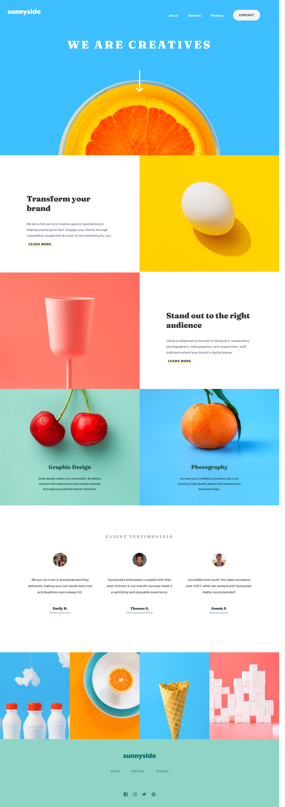

# Frontend Mentor - Sunnyside agency landing page solution

This is a solution to the [Sunnyside agency landing page challenge on Frontend Mentor](https://www.frontendmentor.io/challenges/sunnyside-agency-landing-page-7yVs3B6ef). 

## Table of contents

- [Overview](#overview)
  - [The challenge](#the-challenge)
  - [Screenshot](#screenshot)
  - [Links](#links)
- [My process](#my-process)
  - [Built with](#built-with)
  - [What I learned](#what-i-learned)
  - [Continued development](#continued-development)
- [Acknowledgments](#acknowledgments)

## Overview

### The challenge

Users should be able to:

- View the optimal layout for the site depending on their device's screen size
- See hover states for all interactive elements on the page

### Screenshot



### Links

- Solution URL: https://github.com/esralpay/sunnysideChallenge
- Live Site URL:https://wonderful-torvalds-79739f.netlify.app

## My process

### Built with

- Semantic HTML5 markup
- CSS custom properties
- Flexbox
- Svelte


### What I learned

My major learnings while working through this project.Improved the general understanding of css.

```css (learned how to change .svg color)
For example
.social-media a:hover{
		filter: invert(42%) sepia(93%) saturate(1%) hue-rotate(130deg) brightness(500%) contrast(119%);
	}

```

### Continued development

css animations

## Acknowledgments

Thanks to Erdem Alpay and Zeyneb Koç for their help throught out 
the challenge.

